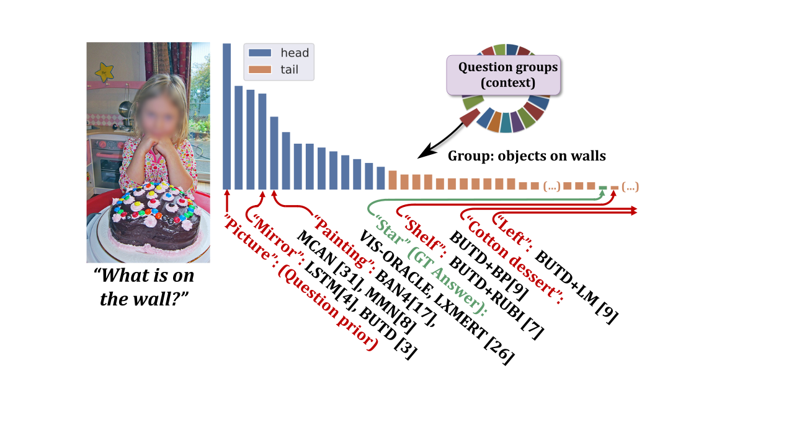
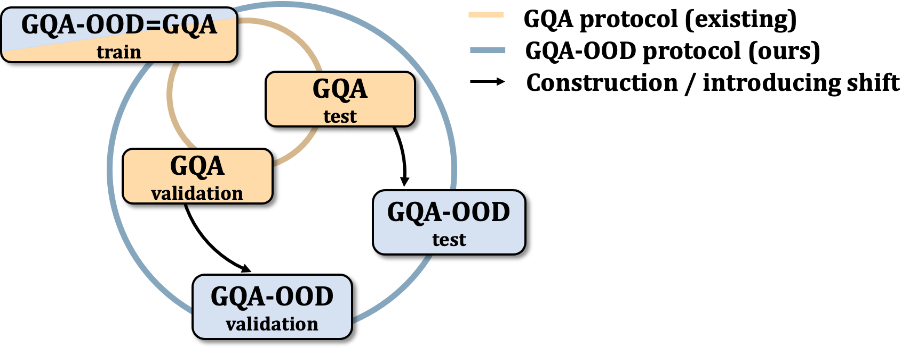
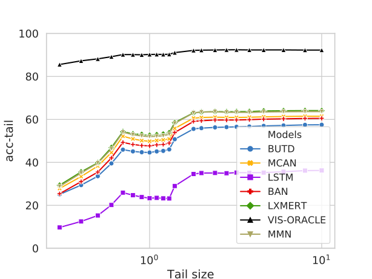
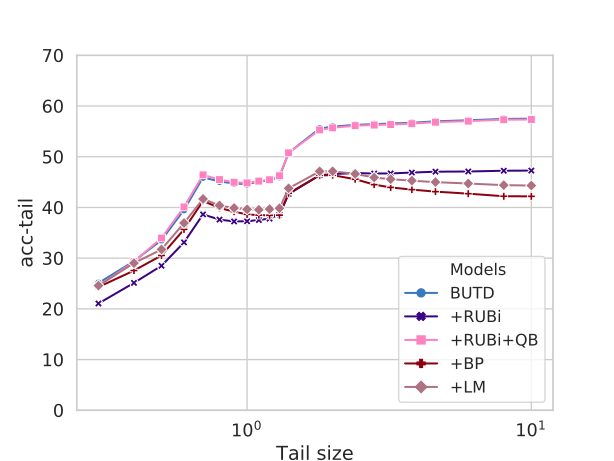

# The GQA-OOD Benchmark 

GQA-OOD is a new dataset and benchmark for the evaluation of VGQ models in OOD (out of distribution) settings. The corresponding paper "*Roses are Red, Violets are Blue... But Should VQA expect Them To?*" is currently under review at the CVPR 2021 conference.

### Abstract ###

  *Visual Question Answering (VQA) models are notorious for their tendency to rely on dataset biases. The large and unbalanced diversity of questions and concepts involved in VQA and the lack of high standard annotated data tend to prevent models from learning to reason, leading them to perform educated guesses instead, relying on specific training set statistics, which is not helpful for generalizing to real world scenarios.*

  *In this paper, we claim that the standard evaluation metric, which consists in measuring the overall in-domain accuracy is misleading. Questions and concepts being unequally distributed, it tends to favor models which exploit subtle training set statistics.*

  *Alternatively, naively evaluating generalization by introducing artificial distribution shift between train and test splits is also not completely satisfying. First, the shifts do not reflect real words tendencies, resulting in unsuitable models; second, since the shifts are artificially handcrafted, trained models are  specifically designed for this particular setting, and paradoxically do not generalize to other configurations.*

  *We propose the GQA-OOD benchmark designed to overcome these concerns: we measure and compare accuracy over, both, rare and frequent question-answer pairs and argue that the former is better suited to the evaluation of reasoning abilities, which we experimentally validate with models trained to more or less exploit biases. In a large-scale study involving 7 VQA models and 3 bias reduction techniques, we also experimentally demonstrate that these models fail to address questions involving infrequent concepts and provide recommendations for future directions of research.*

## How is the VQA's prediction error distributed? What is the prediction accuracy on infrequent vs. frequent concepts? 

GQA-OOD is a benchmark based on a fine-grained reorganization of the [GQA dataset](https://cs.stanford.edu/people/dorarad/gqa/index.html), which allows to precisely answer these questions. It introduces distributions shifts in both validation and test splits, which are defined on question groups and are thus tailored to each question.

 	
## GQA-OOD evaluation data

GQA-OOD evaluation data are provided in "*data/*". You will find three files for each split (validation and testdev). These files correspond to the "*all*", "*head*" and "*tail*" question-anwsers required to compute "*acc-all*", "*acc-head*" and "*acc-tail*".

All evaluation data files respect the GQA annotation format and can directly be used with the [GQA evaluation script](https://cs.stanford.edu/people/dorarad/gqa/evaluate.html) (of course, replace GQA's evaluation datafiles by the GQA-OOD ones). 

## Benchmark

### VQA architectures

We evaluate several VQA architectures on GQA-OOD:

| Model (trained on GQA)           | acc-all      | acc-tail     | acc-head     |
|----------------------------------|--------------|--------------|--------------|
| Quest. Prior                     | 21.6         | 17.8         | 24.1         |
| LSTM                             | 30.7         | 24.0         | 34.8         |
| BUTD   [Anderson et al, CVPR 18] | 46.4 +/- 1.1 | 42.1 +/- 0.9 | 49.1 +/- 1.1 |
| MCAN   [Yu et al, CVPR 19]       | 50.8 +/- 0.4 | 46.5 +/- 0.5 | 53.4 +/- 0.6 |
| BAN4   [Kim et al, NeurIPS 18]   | 50.2 +/- 0.7 | 47.2 +/- 0.5 | 51.9 +/- 1.0 |
| MMN    [Chen et al, preprint 19] | 52.7         | 48.0         | 55.5         |
| LXMERT [Tan et al, EMNLP 19]     | 54.6         | 49.8         | 57.7         |

#### Accuracy vs. question-answer rareness (rare on the left, frequent on the right)

### VQA bias-reducing techniques

We evaluate on GQA-OOD several VQA methods designed to reduce bias dependacy:

| Technique (trained on GQA)       | acc-all      | acc-tail     | acc-head      |
|----------------------------------|--------------|--------------|---------------|
| BUTD [Anderson et al; CVPR 18]   | 46.4 +/- 1.1 | 42.1 +/- 0.9 |  49.1 +/- 1.1 |
| +RUBi+QB                         | 46.7 +/- 1.3 | 42.1 +/- 1.0 | 49.4 +/- 1.5  |
| +RUBi [Cadene et al, NeurIPS 19] | 38.8 +/- 2.4 | 35.7 +/- 2.3 | 40.8 +/- 2.7  |
| +LM  [Clark et al, EMNLP 19]     | 34.5 +/- 0.7 | 32.2 +/- 1.2 | 35.9 +/- 1.2  |
| +BP [Clark et al, EMNLP 19]      | 33.1 +/- 0.4 | 30.8 +/- 1.0 | 34.5 +/- 0.5  |

#### Accuracy vs. question-answer rareness (rare on the left, frequent on the right)

## GQA-OOD construction code

Scripts for dataset construction from the original [GQA](https://cs.stanford.edu/people/dorarad/gqa/index.html) source is available in code/.

